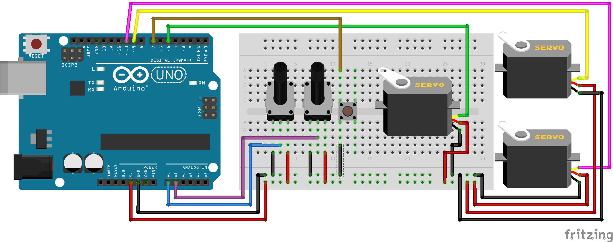
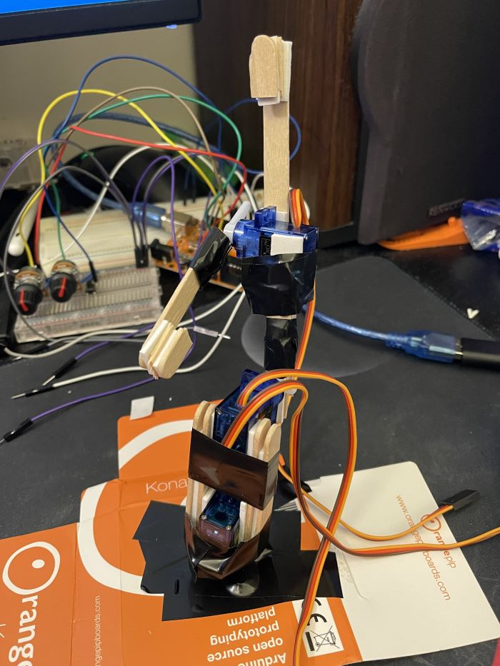
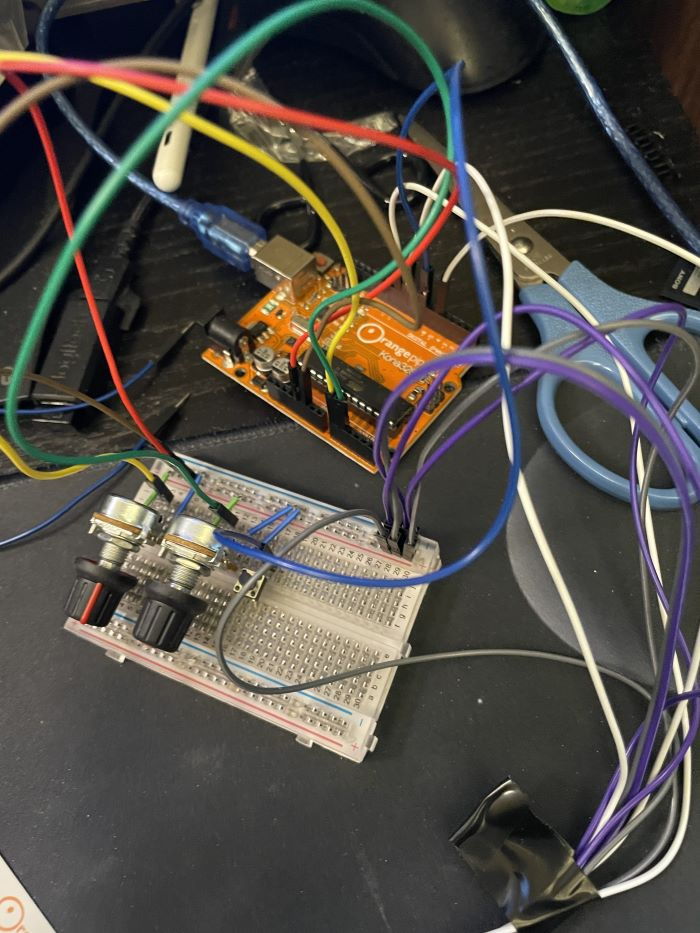

# Robotic-Arm
Robotic arm made using C code. The robot it made out of lollipop sticks, servo motors and an arduino UNO following the schematic:

Photos:

Video:

https://user-images.githubusercontent.com/39654202/232083835-171b3fc9-508f-42b6-a69b-4fdf9922290f.mp4
